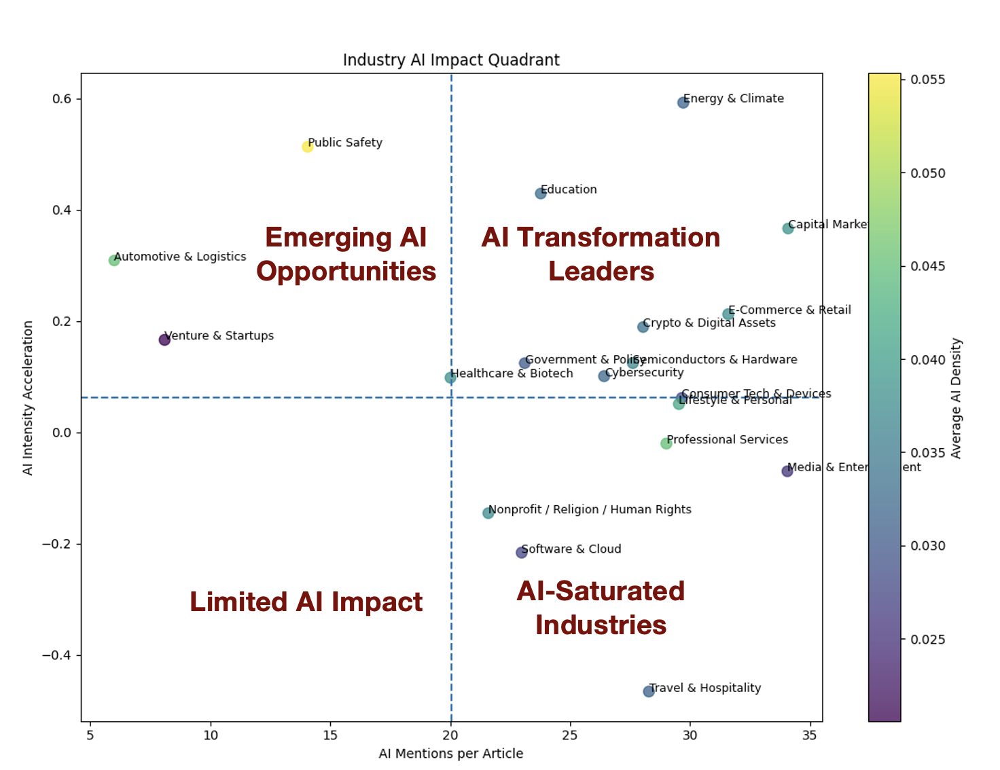

# AI Industry Impact Analysis using NLP

## Overview

This project develops an end-to-end natural language processing (NLP) pipeline to analyze how artificial intelligence (AI) is impacting industries and firms. Using a corpus of ~200,000 news articles, the project extracts structured insights from unstructured text to quantify AI exposure, sentiment, and adoption trends across sectors.

## Research Objective

* Which industries are most exposed to AI?
* How is AI impacting firms (positive, negative, neutral)?
* Through which technologies (e.g., LLMs, GPUs) are these effects occurring?

## Methodology

### 1. Data Processing

* Cleaned raw news articles by removing boilerplate (HTML artifacts, navigation text)
* Standardized text for downstream NLP tasks

### 2. Topic Modeling

* Applied BERTopic with `all-MiniLM-L6-v2` embeddings
* Generated interpretable topic clusters representing AI-related themes

### 3. Named Entity Recognition (NER)

* Used spaCy transformer models to extract:

  * Organization entities (firms)
  * AI-related technologies (custom dictionary: GPT, LLM, NVIDIA, etc.)

### 4. Sentiment Analysis

* Fine-tuned RoBERTa on Financial PhraseBank
* Classified sentiment: positive / neutral / negative
* Computed sentiment score = P(positive) − P(negative)

### 5. AI Exposure Metrics

Constructed industry-level features:

* AI mentions (frequency)
* AI mentions per article
* AI article share
* Temporal sentiment trends

## Results

* Identified industries with highest AI exposure (e.g., Technology, Media, Finance)
* Extracted top firms and technologies driving AI narratives
* Measured sentiment shifts over time
* Visualized industry-level AI intensity and trends

## Repository Structure

```
project/
│
├── notebooks/
│   └── nlp_pipeline.ipynb
│
├── data/
│   └── (sample or description only)
│
├── outputs/
│   └── figures, tables
│
├── requirements.txt
└── README.md
```

## Tech Stack

* Python (pandas, NumPy)
* BERTopic, sentence-transformers
* spaCy (NER)
* Hugging Face Transformers (RoBERTa)
* Matplotlib / Seaborn

## How to Run

1. Clone the repository
2. Install dependencies:

```
pip install -r requirements.txt
```

3. Open the notebook:

```
notebooks/nlp_pipeline.ipynb
```

## Data

The dataset consists of ~200,000 news articles related to AI and machine learning.
Due to size constraints, raw data is not included. A sample or schema is provided.

## Key Contributions

* Built a scalable NLP pipeline for large-scale text analysis
* Integrated topic modeling, NER, and sentiment into a unified framework
* Developed interpretable metrics for AI exposure and industry impact

## Future Work

* Causal inference on AI adoption and firm outcomes
* Network analysis of firm–technology relationships

## Topic Visualization


---
